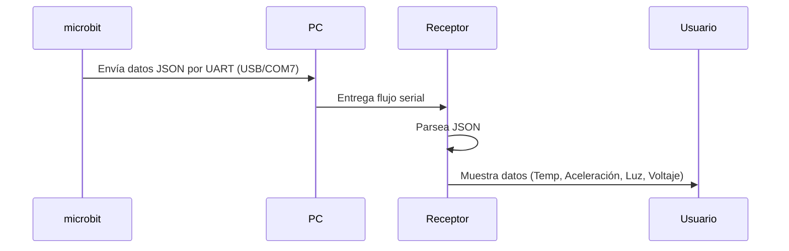

# Microbit-6-en-1-Lenguaje-de-Progamacion

Ernesto Torres Pineda
22211665
27/10/2025

**Lenguajes Receptores:** Python, C++, Java, C#, JavaScript (Node.js), Go

---

## 1. Descripción General del Sistema

Este sistema implementa una comunicación **serial por USB (UART emulado)** entre una **placa micro:bit v2** y una computadora.
El micro:bit ejecuta un script en **MicroPython** que genera y envía periódicamente datos en formato **JSON**, simulando lecturas de sensores.

Cada programa receptor, escrito en un lenguaje distinto, escucha el **puerto COM7** y muestra los datos recibidos en la terminal.

Los datos simulados incluyen:

* Identificador del dispositivo
* Marca de tiempo (timestamp)
* Temperatura (°C)
* Aceleración (x, y, z)
* Nivel de luz
* Voltaje de batería

---

## 2. Diagrama del Flujo de Datos

```
             ┌──────────────────┐
             │  micro:bit v2    │
             │ (Emisor JSON)    │
             └───────┬──────────┘
                     │
                     │  USB (UART / COM7)
                     ▼
           ┌────────────────────────┐
           │      Computadora       │
           │  (Puerto Serial COM7)  │
           └────────┬───────────────┘
                    │
     ┌──────────────┼─────────────────────────────┐
     │              │              │              │
     ▼              ▼              ▼              ▼
 ┌────────┐    ┌────────┐    ┌────────┐    ┌────────┐
 │Python  │    │C++     │    │Java    │    │C#      │
 └────────┘    └────────┘    └────────┘    └────────┘
     │              │              │              │
     ▼              ▼              ▼              ▼
 ┌────────┐    ┌────────┐    ┌────────┐    ┌────────┐
 │Node.js │    │Go      │    │...     │    │...     │
 └────────┘    └────────┘    └────────┘    └────────┘

```

---

## 3. Código del Emisor (micro:bit v2 - MicroPython)

Guarda este código en el micro:bit con nombre `microbit_sender.py`.

```python
from microbit import *
import utime, json

DEVICE_ID = "M1"

while True:
    ax = accelerometer.get_x() / 1024
    ay = accelerometer.get_y() / 1024
    az = accelerometer.get_z() / 1024
    tempC = temperature()
    light = display.read_light_level()
    bat = 3.1  # Voltaje simulado

    data = {
        "id": DEVICE_ID,
        "ts": utime.time(),
        "tempC": tempC,
        "ax": ax,
        "ay": ay,
        "az": az,
        "light": light,
        "bat": bat
    }

    print(json.dumps(data))
    sleep(500)
```
---

## 4. Programas Receptores

Cada programa debe configurarse para leer **COM7** a **115200 baudios**.

### 4.1 Receptor en Python

```python
# Receptor Pico - Python
# Lee datos JSON desde el puerto serial COM7 y los muestra en pantalla

import pyserial, json

puerto = "COM7"
baud = 115200

# Usamos un 'with' para asegurar que el puerto se cierre correctamente
with pyserial.Serial(puerto, baud, timeout=1) as ser:
    print(f"Conectado a {puerto}. Esperando datos del Pico...\n")
    while True:
        try:
            # 1. Leer una línea completa (hasta '\n')
            linea = ser.readline().decode('utf-8').strip()

            # 2. Si la línea está vacía, saltar a la siguiente iteración
            if not linea:
                continue
            
            # 3. Convertir el string JSON a un diccionario de Python
            data = json.loads(linea)

            # 4. Imprimir los datos (¡Corregido!)
            # Cambiamos data['id'] por data['ts']
            print(f"[TS: {data['ts']}] Temp: {data['tempC']}°C | Luz: {data['light']} | "
                  f"Acc: ({data['ax']:.2f}, {data['ay']:.2f}, {data['az']:.2f}) | "
                  f"Bat: {data['bat']}V")

        except json.JSONDecodeError:
            # Es buena práctica capturar errores específicos
            print(f"Error: No se pudo decodificar JSON. Línea recibida: '{linea}'")
        except KeyError as e:
            # Este error ocurriría si falta una clave (como 'id' antes)
            print(f"Error: Clave no encontrada: {e}. Datos: {data}")
        except Exception as e:
            # Captura general para otros problemas (ej. puerto desconectado)
            print(f"Error inesperado: {e}")
```
---

### 4.2 Receptor en C++ (Boost::Asio)

```C++
#include <iostream>
#include <string>
#include <boost/asio.hpp>
#include <nlohmann/json.hpp>

using namespace boost::asio;
using json = nlohmann::json;

int main() {
    try {
        io_context io;
        serial_port puerto(io, "COM7");
        puerto.set_option(serial_port_base::baud_rate(115200));

        std::cout << "Esperando datos del Pico...\n\n";

        // 1. Usa un streambuf para una lectura eficiente
        streambuf b;
        std::string linea;

        while (true) {
            // 2. Lee del puerto HASTA que encuentre un salto de línea
            read_until(puerto, b, '\n');

            // 3. Extrae la línea leída del buffer
            std::istream is(&b);
            std::getline(is, linea);
            
            // Opcional: Limpiar el carácter '\r' si está presente
            if (!linea.empty() && linea.back() == '\r') {
                linea.pop_back();
            }

            if (linea.empty()) continue;

            try {
                auto data = json::parse(linea);
                std::cout << "[" << data["id"].get<std::string>() << "] "
                          << "Temp: " << data["tempC"].get<int>() << "°C | "
                          << "Luz: " << data["light"].get<int>() << " | "
                          << "Acc: (" << data["ax"].get<float>() << ", "
                          << data["ay"].get<float>() << ", " << data["az"].get<float>() << ") | "
                          << "Bat: " << data["bat"].get<float>() << "V\n";

            } catch (json::exception& e) {
                // Captura errores de JSON de forma más segura
                std::cerr << "Error JSON: " << e.what() << " | Linea: '" << linea << "'\n";
            }
        }
    } catch (std::exception& e) {
        // Captura errores del puerto (ej. "Dispositivo no encontrado")
        std::cerr << "Error de Puerto: " << e.what() << "\n";
        return 1;
    }
}
```
---

### 4.3 Receptor en Java (jSerialComm + org.json)

```Java
import com.fazecast.jSerialComm.SerialPort;
import com.fazecast.jSerialComm.SerialPortDataListener;
import com.fazecast.jSerialComm.SerialPortEvent;
import org.json.JSONObject;
import java.nio.charset.StandardCharsets;

public class Receptor {

    // Un buffer persistente para guardar datos parciales
    private static StringBuilder lineaParcial = new StringBuilder();

    public static void main(String[] args) {
        SerialPort puerto = SerialPort.getCommPort("COM7");
        puerto.setBaudRate(115200);

        // 1. Configurar un "Listener" (oyente) de eventos
        puerto.addDataListener(new SerialPortDataListener() {
            @Override
            public int getListeningEvents() {
                // Queremos ser notificados solo cuando lleguen datos
                return SerialPort.LISTENING_EVENT_DATA_RECEIVED;
            }

            @Override
            public void serialEvent(SerialPortEvent event) {
                if (event.getEventType() != SerialPort.LISTENING_EVENT_DATA_RECEIVED)
                    return; // No es el evento que nos interesa

                // Leer todos los bytes que hayan llegado en este evento
                byte[] datosRecibidos = event.getReceivedData();
                
                // Convertirlos a String y añadirlos a nuestro buffer
                lineaParcial.append(new String(datosRecibidos, StandardCharsets.UTF_8));

                // Procesar CUALQUIER línea completa que tengamos en el buffer
                procesarBuffer();
            }
        });

        // 2. Abrir el puerto
        if (puerto.openPort()) {
            System.out.println("Puerto COM7 abierto. Esperando datos del Pico...");
        } else {
            System.err.println("Error: No se pudo abrir el puerto COM7.");
            return;
        }

        // 3. Mantener el programa vivo (AQUÍ ESTÁ EL CAMBIO)
        // El Listener trabaja en su propio hilo (thread)
        // El hilo 'main' se duerme para no morir y no usa "while(read...)"
        try {
            while (true) {
                Thread.sleep(1000); // Dormir para no consumir CPU
            }
        } catch (InterruptedException e) {
            puerto.closePort();
            System.out.println("\nPrograma terminado. Puerto cerrado.");
        }
    }

    /**
     * Revisa el buffer 'lineaParcial' en busca de líneas completas (con '\n')
     * y las procesa. (ESTO ARREGLA EL ERROR DE "DUPLICATE KEY")
     */
    private static void procesarBuffer() {
        int indiceSaltoDeLinea;
        
        // Bucle 'while' por si llegaron MÚLTIPLES líneas en un solo evento
        while ((indiceSaltoDeLinea = lineaParcial.indexOf("\n")) >= 0) {
            
            // 1. Extraer la línea completa (hasta el \n)
            String linea = lineaParcial.substring(0, indiceSaltoDeLinea).trim();
            
            // 2. Borrar esa línea (y el \n) del buffer
            lineaParcial.delete(0, indiceSaltoDeLinea + 1);

            if (linea.isEmpty()) continue;

            System.out.println("Crudo: " + linea);

            // 3. Intentar parsear el JSON
            try {
                JSONObject data = new JSONObject(linea);
                System.out.printf("[%s] Temp: %.1f °C | Acc: [%.2f, %.2f, %.2f] | Luz: %d | Bat: %.2fV\n",
                        data.getString("id"),
                        data.getDouble("tempC"),
                        data.getDouble("ax"),
                        data.getDouble("ay"),
                        data.getDouble("az"),
                        data.getInt("light"),
                        data.getDouble("bat"));

            } catch (org.json.JSONException e) {
                System.err.println("Error JSON: " + e.getMessage());
            }
        }
    }
}
```
---

### 4.4 Receptor en C# (.NET)

```
// Receptor Micro:bit - C#
using System;
using System.IO.Ports;
using System.Text.Json;

class Program
{
    static void Main()
    {
        SerialPort puerto = new SerialPort("COM7", 115200);
        puerto.Open();
        Console.WriteLine("Esperando datos del micro:bit...\n");

        while (true)
        {
            try
            {
                string linea = puerto.ReadLine().Trim();
                var data = JsonSerializer.Deserialize<JsonElement>(linea);
                Console.WriteLine($"[{data.GetProperty("id").GetString()}] " +
                    $"Temp: {data.GetProperty("tempC")}°C | " +
                    $"Luz: {data.GetProperty("light")} | " +
                    $"Acc: ({data.GetProperty("ax")}, {data.GetProperty("ay")}, {data.GetProperty("az")}) | " +
                    $"Bat: {data.GetProperty("bat")}V");
            }
            catch (Exception ex)
            {
                Console.WriteLine("Error: " + ex.Message);
            }
        }
    }
}
```
---

### 4.5 Receptor en JavaScript (Node.js)

```
// Receptor Micro:bit - Node.js
// Lee JSON desde COM3 y lo muestra en consola

import { SerialPort, ReadlineParser } from 'serialport';

const port = new SerialPort({ path: 'COM7', baudRate: 115200 });
const parser = port.pipe(new ReadlineParser({ delimiter: '\n' }));

console.log('Esperando datos del micro:bit...\n');

parser.on('data', line => {
  try {
    const data = JSON.parse(line);
    console.log(`[${data.id}] Temp: ${data.tempC}°C | Luz: ${data.light} | `
      + `Acc: (${data.ax.toFixed(2)}, ${data.ay.toFixed(2)}, ${data.az.toFixed(2)}) | `
      + `Bat: ${data.bat}V`);
  } catch (err) {
    console.error('Error:', err);
  }
});
```
---

### 4.6 Receptor en Go

```
package main

import (
	"bufio"
	"encoding/json"
	"fmt"
	"log"

	"go.bug.st/serial"
)

func main() {
	mode := &serial.Mode{BaudRate: 115200}
	port, err := serial.Open("COM7", mode)
	if err != nil {
		log.Fatal(err)
	}
	defer port.Close()

	fmt.Println("Esperando datos del micro:bit...\n")

	scanner := bufio.NewScanner(port)
	for scanner.Scan() {
		line := scanner.Text()
		var data map[string]interface{}
		if err := json.Unmarshal([]byte(line), &data); err != nil {
			fmt.Println("Error:", err)
			continue
		}
		fmt.Printf("[%s] Temp: %.0f°C | Luz: %.0f | Acc: (%.2f, %.2f, %.2f) | Bat: %.1fV\n",
			data["id"], data["tempC"], data["light"], data["ax"], data["ay"], data["az"], data["bat"])
	}
}
```
---

## 5. Formato del Mensaje JSON

Cada línea enviada por el micro:bit contiene un objeto JSON con esta estructura:

```
{
  "id": "M1",
  "ts": 1730063432,
  "tempC": 24.3,
  "ax": 0.01,
  "ay": 0.02,
  "az": 0.03,
  "light": 120,
  "bat": 3.1
}
```

---

## 6. Funcionamiento General

1. **El micro:bit genera los datos** cada 500 ms y los envía por el puerto USB.
2. El sistema operativo lo detecta como un **puerto serie (COM7)**.
3. Cada receptor se conecta al puerto y **lee una línea de texto JSON**.
4. El receptor **parsea el JSON** y **muestra los valores** en la consola.
5. Si el JSON está incompleto o corrupto, el programa lo ignora y continúa.

---

## 7. Diagrama Resumen del Proceso



---

## 8. Espacios para Resultados de Prueba

**Salida esperada (ejemplo):**

```
Crudo: {"id":"M1","ts":1730063432,"tempC":24.3,"ax":0.01,"ay":0.02,"az":0.03,"light":120,"bat":3.1}
Temp: 24.3 °C | Aceleración: [0.01, 0.02, 0.03] | Luz: 120 | Voltaje: 3.10
```

**Observaciones:**

* [ ] Los datos se imprimen cada 500 ms
* [ ] El LED del micro:bit parpadea al enviar datos
* [ ] El formato JSON se mantiene correcto

---

## 9. Posibles Mejoras Futuras

* Enviar datos reales de sensores integrados (acelerómetro, temperatura, luz).
* Incorporar transmisión inalámbrica usando Bluetooth.
* Guardar los datos en una base de datos o graficarlos en tiempo real.
* Implementar control bidireccional (PC → micro:bit).

---

## 10. Conclusión

Este sistema demuestra la interoperabilidad entre un **microcontrolador educativo (micro:bit v2)** y múltiples **lenguajes de programación** mediante comunicación **serial y formato JSON**.
La arquitectura modular permite extender el sistema para **análisis, monitoreo o registro** de datos en diferentes entornos de programación.

